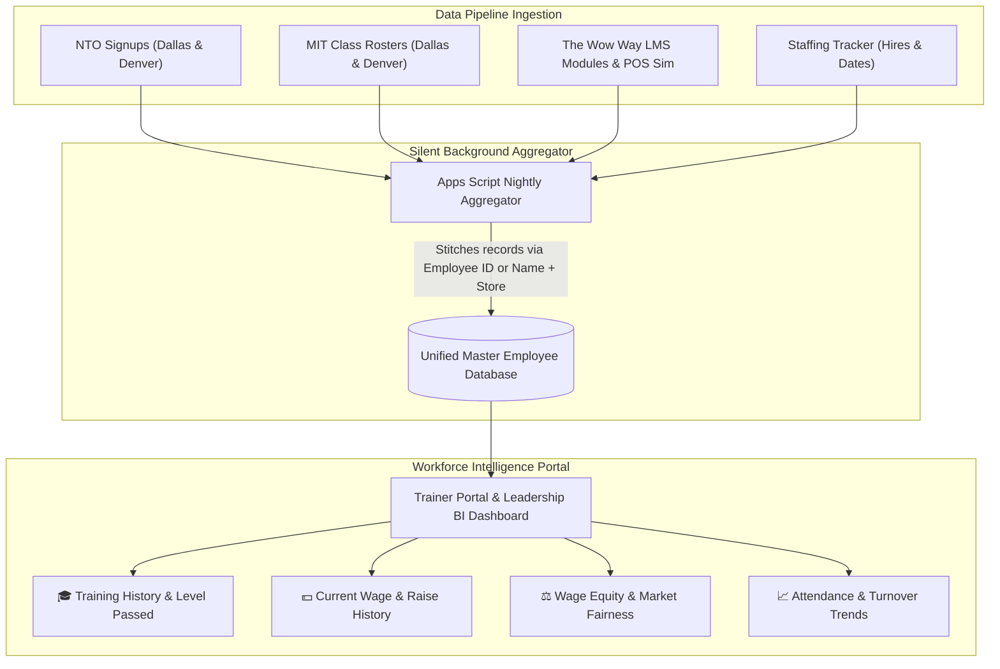

# 📊 Trainer Portal & Workforce Intelligence Roadmap

**Document Created:** August 20, 2026  
**Author / Visionary:** Mike Jacobs  
**Repository:** `TW-Career-Path` / `LMS_Git`  
**Target File:** `trainer_portal_v1.html` (to be evolved into Workforce Intelligence Hub)

---

## 🎯 Executive Summary & Purpose

The Trainer Portal is designed as Team WOW's **Central Workforce Intelligence & Promotion Decision Engine**. 

While employee onboarding and class signups occur on distributed public portals (NTO Signups, MIT Signups, Staffing Trackers), this portal serves as the **single source of truth for employee progression, wage equity, and promotion readiness**.

---

## 🔍 Core Intelligence Pillars

### 1. 🎓 Training History & Performance Tracking
* Complete record of every class attended (NTO, MIT, special workshops).
* Track performance scores, instructor feedback, level certifications, and attendance records (e.g. tracking `No Show (x2)`).
* Real-time verification of prerequisite completion in **The Wow Way Learning Hub**.

### 2. 💵 Compensation & Equity Auditing
* Current hourly pay rate and historical record of previous wage bumps.
* Date and tenure since last raise.
* Store and market-level wage equity auditing (ensuring fair, competitive, and consistent pay rates across Dallas, Denver, El Paso, and LA).

### 3. 🚀 1-Click Raise & Promotion Decision Engine
* Eliminates guesswork when store GMs request raises or role promotions.
* Instant evaluation formula:
  $$\text{Eligibility Verdict} = \text{Tenure} + \text{NTO/MIT Completion} + \text{LMS Modules Passed} + \text{Wage History}$$

### 4. 📈 Store & Market Talent Health Scorecards
* Hiring and separation/turnover trends by store.
* Attendance reliability and no-show rates for scheduled classes.
* Early identification of store-level training and staffing gaps.

---

## 🛠️ Data Harvesting Strategy: "Passive Pipeline Aggregation"

**Problem:** Manual data entry across multiple systems leads to stale data and administrative fatigue.  
**Solution:** Do not create a new manual spreadsheet. Silently harvest and stitch together data from existing active endpoints.

| Existing Data Stream | What It Captures | Key Identifier |
| :--- | :--- | :--- |
| **Staffing Tracker** | Hire Date, Store, Role, Initial Wage | Employee ID / Name + Store |
| **NTO Roster** | Orientation Date, Attendance Status | Name + Store |
| **MIT Roster (`classes.html`)** | Class Name, Date, Enrollment, Instructor Notes | Name + Store |
| **The Wow Way LMS** | Module Checkpoints Passed, POS Sim Stages | Employee ID |
| **Promotion / Raise Requests** | New Wage Requested, Date, GM Approval | Employee ID |

### Aggregation Architecture:
1. An automated Apps Script trigger runs periodically (e.g., nightly).
2. Reads records from the separate sheets and merges them into a single cached `Master_Employee_State` tab.
3. The front-end portal fetches from this consolidated endpoint for sub-second lookup performance.
4. **Progressive Enrichment:** Data is populated naturally as employees move through classes and milestones. Missing wage fields degrade gracefully (`Pay Rate: Not Logged - Click to add`).

---

## 🎨 UI/UX Evolution Plan (`trainer_portal_v1.html`)

1. **Top Command Bar:**
   * Dynamic live date & time (market-specific timezones).
   * Market switcher pill tabs (**Dallas \| Denver \| El Paso \| LA**).
   * Global instant search bar with live auto-suggest autocomplete.
2. **Executive KPI Stat Counters:**
   * Active Trainees in Pipeline.
   * Recent Certifications / Level Ups.
   * Pending Promotion & Raise Reviews.
   * Attendance Health Index (% attended vs no-show).
3. **Employee Dossier Modal:**
   * Comprehensive single-view employee card with training badges, wage history, notes, and equity status.
4. **Design System Tokens:**
   * Full alignment with Team WOW brand fonts (`PizzaPress`, `OneDotCd`), crust color palette (`#0090e2`, `#ff0000`, `#faf2e9`, `#603913`), and modern glassmorphic card styling.

---

## 🔗 Related Ecosystem Links & Repositories

* **Career Path Hub:** [https://tw-dallas.github.io/TW-Career-Path/](https://tw-dallas.github.io/TW-Career-Path/)
* **The Wow Way LMS:** [https://tw-dallas.github.io/TW-Career-Path/lms_dashboard.html](https://tw-dallas.github.io/TW-Career-Path/lms_dashboard.html)
* **Dallas MIT Signups:** [https://tw-dallas.github.io/TW-Career-Path/classes.html](https://tw-dallas.github.io/TW-Career-Path/classes.html)
* **Denver MIT Signups:** [https://tw-dallas.github.io/TW-Career-Path/denver_classes.html](https://tw-dallas.github.io/TW-Career-Path/denver_classes.html)
* **Dallas NTO Portal:** [https://tw-dallas.github.io/TWDallas-New-Hire-Hub/](https://tw-dallas.github.io/TWDallas-New-Hire-Hub/)
* **Denver NTO Portal:** [https://tw-dallas.github.io/twdenver-orientation/denver_index.html](https://tw-dallas.github.io/twdenver-orientation/denver_index.html)
* **Staffing Trackers:** Dallas & Denver Admin Hubs
* **Catering Hub:** [https://tw-dallas.github.io/TW-Career-Path/Catering_Hub.html](https://tw-dallas.github.io/TW-Career-Path/Catering_Hub.html)
* **Prototype Portal File:** [trainer_portal_v1.html](file:///c:/Users/micha/OneDrive%20-%20Casey%20Professional%20Consulting,%20Inc/LMS_Git/TW-Career-Path/trainer_portal_v1.html)
